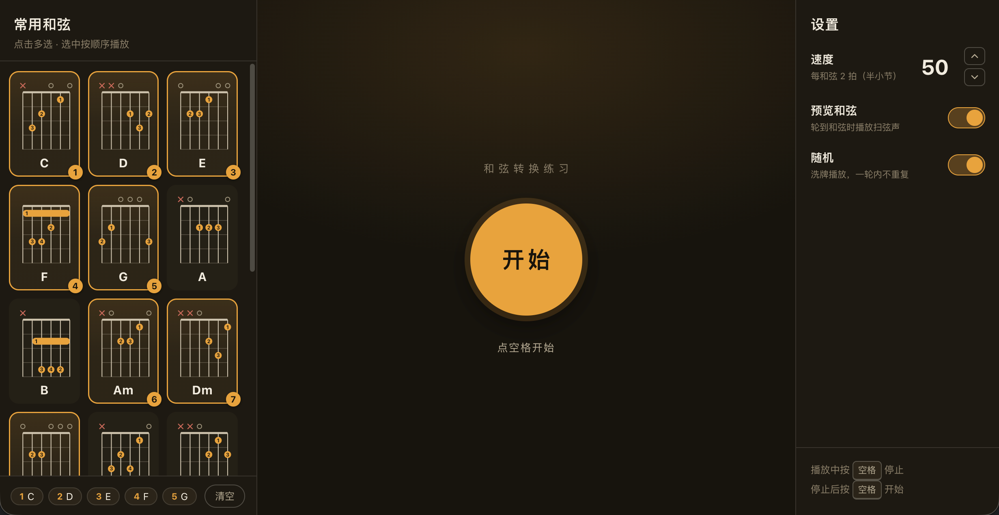
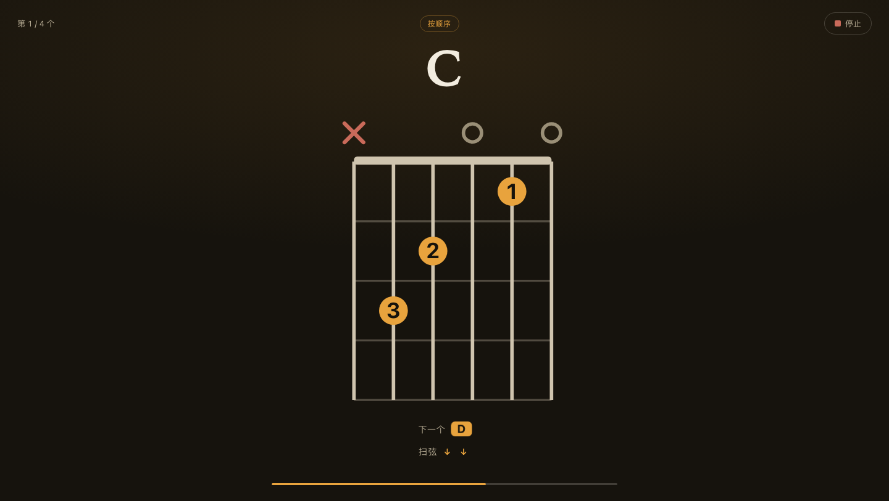
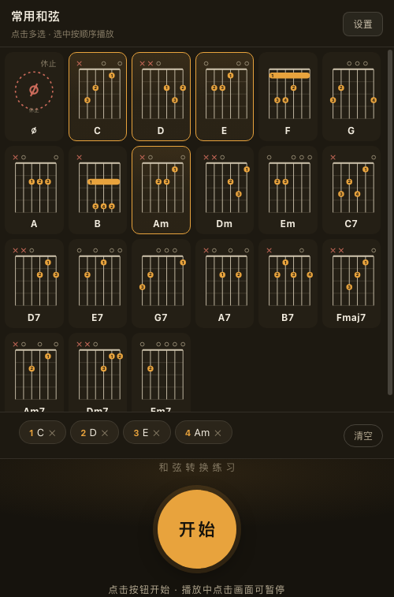

# 和弦播放器
面向吉他初学者的入门工具
- **主要功能：和弦转换练习** 不承担编曲、演奏或音乐制作功能。
- **次要功能：熟悉和弦指法** 不断的切换过程中熟悉指法
- **次次要功能：感受和弦走向** 编排目标曲目和弦走向

纯 HTML/CSS/JS 单文件应用，无需安装、无需联网，双击即可运行。桌面与手机浏览器均适配。

## 功能与设置

- 和弦编排：22 个常用和弦，加休止符，支持多选与重复选中（复现歌曲和弦走向）
- 和弦播放：按bpm顺序或随机播放和弦图
- BPM调节：20–200，每和弦 4 拍
- 扫弦节奏：两种可选（四分全下 / 二分全下）
- 预览扫弦：（真实吉他采样）可关，关闭后为节拍器声
- 和弦预告：切换前高亮提醒，练习提前反应，可开关
- 快捷键：空格 开始/暂停，回车 开始，Esc 退出

## 截图

| 和弦选择 | 播放中 |
| --- | --- |
|  |  |

移动端：

| 未开始 | 播放中 |
| --- | --- |
|  |  |

## 使用

- 直接双击 `播放器本体/index.html`，或拖入浏览器打开。
- 手机下载文件后，浏览器或html查看器打开
- 使用脚本在电脑启动站点，手机打开地址预览（手机与本机连同一 WiFi）：

```bash
./serve.sh          # 默认 5173 端口
./serve.sh 8080     # 指定端口
```
启动后终端显示 Network 地址，手机浏览器打开即可。

## 配置与自定义

所有玩法配置（和弦库、扫弦节奏、节拍、主题配色）都集中在 `播放器本体/index.html` 顶部的「配置区」，改完保存刷新即生效。

功能设计细节、每个配置项的作用与修改方法，见 **[配置与设计说明](配置与设计说明.md)**。

快速示例——增加一个自定义和弦：

```js
{ name:'Cadd9', frets:[-1, 3, 2, 0, 3, 0], fingers:[0, 3, 2, 0, 4, 0] }
```

- `frets`：六弦品格（低 E → 高 e），`-1` 闷音（X），`0` 空弦
- `fingers`：按弦手指 1–4，`0` 不按
- `barre`：可选横按配置 `{ fret, from, to }`

## 反馈与支持

- 问题或建议：[GitHub Issues](https://github.com/StarJiao/GuitarChordPlayer/issues)
- 支持作者：设置面板「反馈与支持」→「捐赠」

## License

[MIT](LICENSE)
